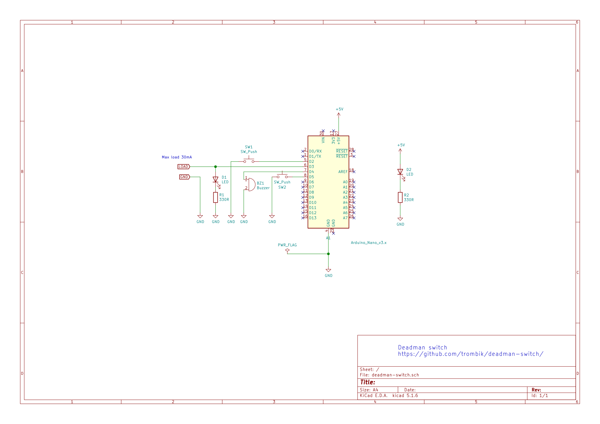

# `deadman-switch`

A deadman's switch implemented on AVR. Connect an AC relay module, or FET
transistor to the load. When the pre-defined time passes, the load is turned
off. To keep it on, you need to press a button.

## Rationale

When soldering, I often forget to turn off the soldering iron. If you keep the
soldering iron on, it causes damage to soldering tip. A simple `deadman
switch` ensures that the soldering iron is off if I'm dead.

`deadman` is chosen in the project name because it sounds odd, and makes
people curious about why it is called so when teaching. I do understand
opinions against the usage of the term ([Why you should stop using the term ‘
Deadman](https://machinerysafety101.com/2011/03/28/stop-using-the-term-deadman/)),
and the term should not be used in official documents.

## Schematic

## Notes

`D1` and `R1` draw 10mA. The load should not draw more than 30mA from the GPIO
(the max current is 40mA).
